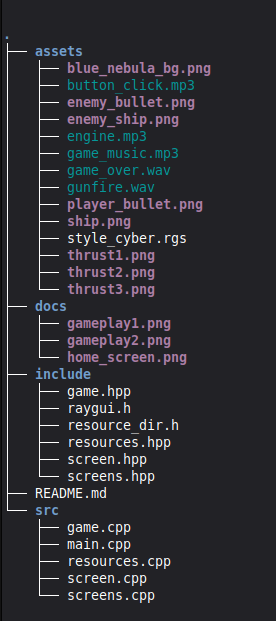
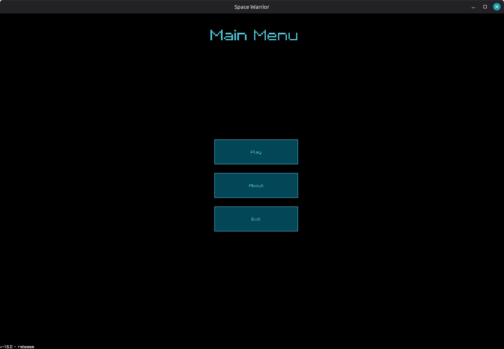
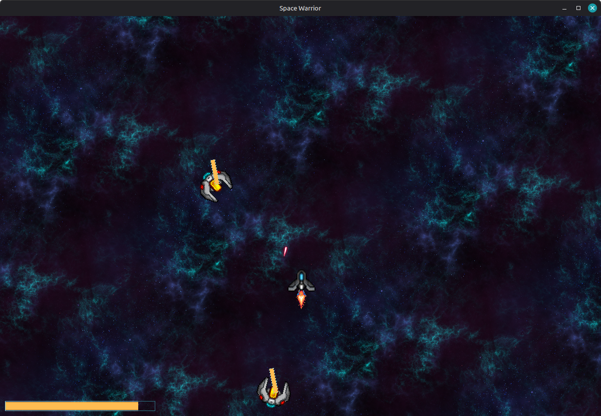
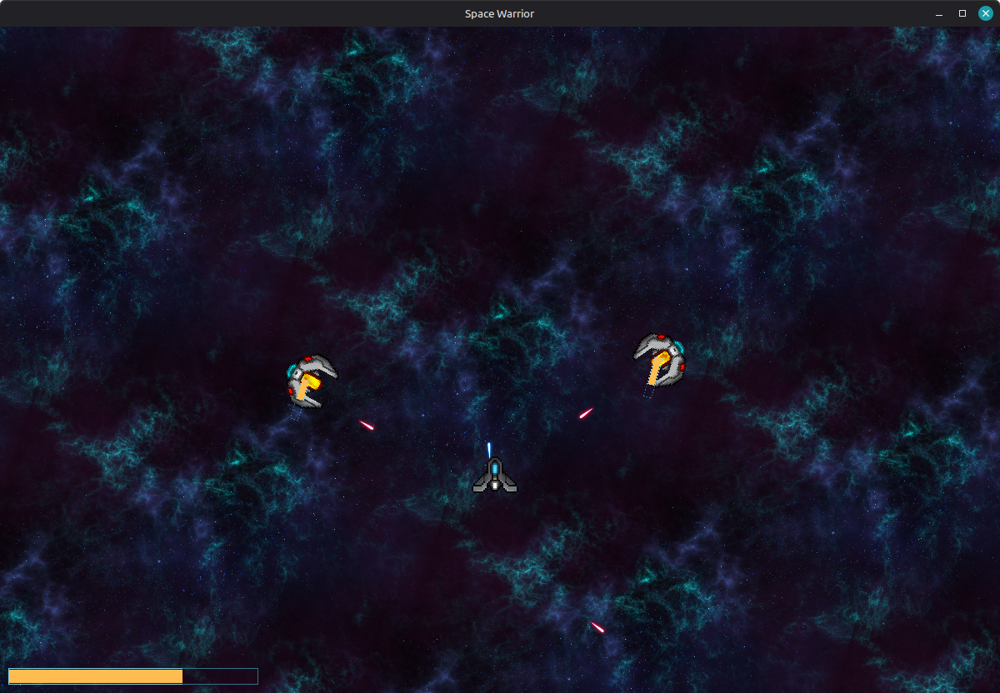

# 🪐 Space Warrior

**Space Warrior** is an arcade-style 2D space shooter game built using **C/C++ with raylib**.  
Control your spaceship, dodge incoming obstacles, and destroy enemies to achieve the highest score.  
Lightweight, fast, and cross-platform — perfect for beginners and enthusiasts learning game development.

---

## 🚀 Features

- Smooth 2D arcade gameplay  
- Player-controlled spaceship  
- Enemy ships & asteroid obstacles  
- Shooting mechanics with bullets  
- Collision detection  
- Score tracking  
- Multiple screens (Menu, Game, About)  
- Built with **raylib** and **C/C++**

---

## 📦 Clone the Repository

```sh 
git clone https://github.com/cgm-game/spacewarrior.git
cd spacewarrior
```
**Note** - After clonning click on code runner and run c++ file and after that click on option Run preLaunch Task and game is started!
## 🛠️ Requirements

Make sure the following are installed on your system:

- C/C++ compiler - GNU GCC, MinGW(web64devkit) or clang
- raylib library
- Make

## Compile & Run

- Open project in vscode
- Open any source file (`.cpp`)
- Click Run C/C++ File
- Select "Run preLaunchTask: build release"

The build script will automatically install raylib if not already installed.

## 🎮 Controls
- Move - press W key
- shoot - click mouse button
- Quit Game - ESC

## 🗂️ Project Structure

Below is a visual representation of the repository structure.



## 🖼️ Screenshots

Some in-game screenshots and UI previews from `docs/images/`:







## Contributors✨

 **Gyan Prakash (2023ug1091)**  
 gyan.2023ug1091@iiitranchi.ac.in

 **Shubham Kumar (2023ug1090)**  
 shubham.2023ug1090@iiitranchi.ac.in  

 **Shubham Singh (2023ug1099)**  
 shubham.2023ug1099@iiitranchi.ac.in 

 **Kasturi Marandi (2023ug1114)**  
 kasturi.2023ug1114@iiitranchi.ac.in  

